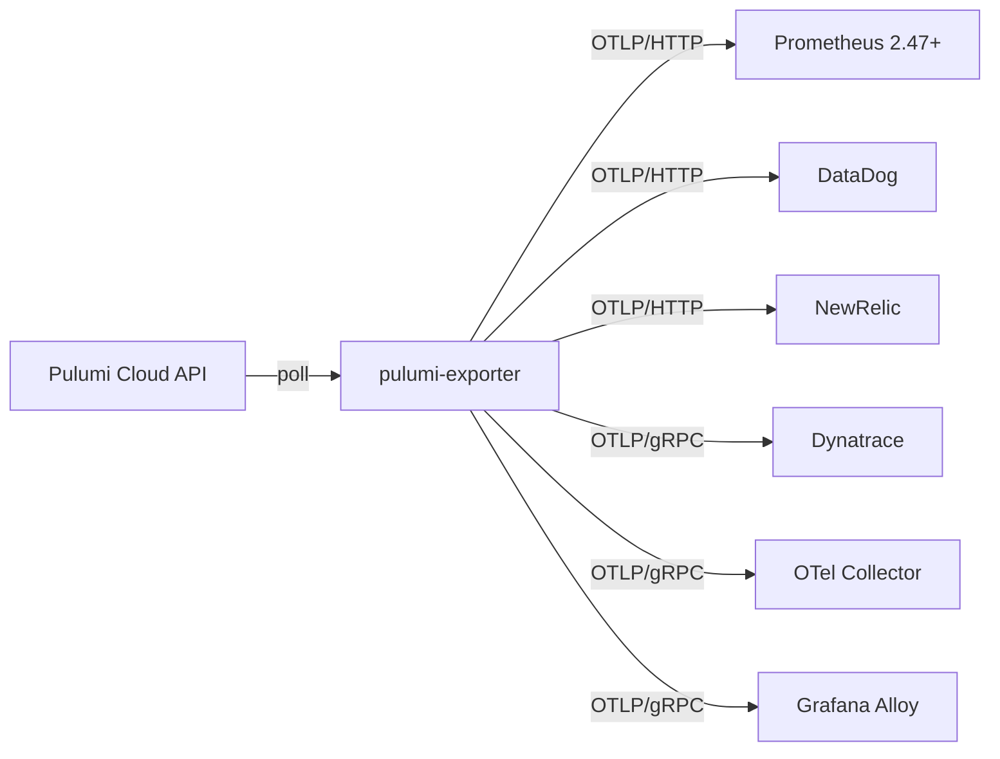
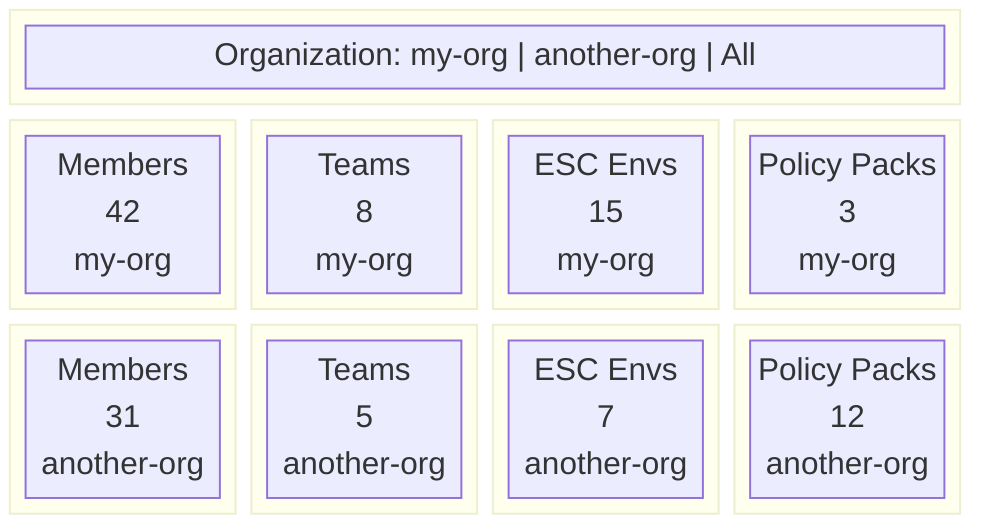

# pulumi-exporter

[](https://artifacthub.io/packages/search?repo=pulumi-exporter)

An OpenTelemetry metrics exporter for [Pulumi Cloud](https://www.pulumi.com/product/pulumi-cloud/). It polls the Pulumi API on a schedule and pushes metrics over OTLP to whatever backend you use.



The API client is generated from the official [Pulumi Cloud OpenAPI spec](https://www.pulumi.com/blog/announcing-openapi-support-pulumi-cloud/) using [oapi-codegen](https://github.com/oapi-codegen/oapi-codegen). The image is built on `cgr.dev/chainguard/static` (distroless, zero CVEs). All release artifacts are signed with [Cosign](https://github.com/sigstore/cosign) and include an SBOM.

## Quick start

The fastest way to get metrics flowing is Docker Compose. It spins up Prometheus, Grafana, and the exporter with a pre-built dashboard.

```bash
cd deploy/docker-compose
cp .env.example .env
# Set PULUMI_ACCESS_TOKEN and PULUMI_ORGANIZATIONS in .env
make compose-up
```

Open Grafana at http://localhost:3000 (admin / admin). The dashboard loads automatically.

## Install

### Helm (Kubernetes)

```bash
helm install pulumi-exporter oci://ghcr.io/pulumi-labs/charts/pulumi-exporter \
  --set existingSecret=pulumi-credentials \
  --set "pulumiOrganizations={my-org}" \
  --set otlp.endpoint=otel-collector:4318 \
  --set otlp.insecure=true
```

See the [chart README](charts/pulumi-exporter/README.md) for all values.

### Pulumi

Deploy the Helm chart using Pulumi in YAML, TypeScript, or Python. Example programs live under `deploy/`:

```bash
cd deploy/pulumi-yaml      # or pulumi-typescript / pulumi-python
pulumi stack init dev
pulumi config set --secret pulumi-access-token pul-xxx
pulumi config set organizations my-org
pulumi up
```

See [deploy/pulumi-yaml/](deploy/pulumi-yaml/), [deploy/pulumi-typescript/](deploy/pulumi-typescript/), and [deploy/pulumi-python/](deploy/pulumi-python/) for the full programs.

### Docker

```bash
docker run --rm \
  -e PULUMI_ACCESS_TOKEN=pul-xxx \
  -e PULUMI_ORGANIZATIONS=my-org \
  -e OTEL_EXPORTER_OTLP_ENDPOINT=otel-collector:4318 \
  -e OTEL_EXPORTER_OTLP_INSECURE=true \
  ghcr.io/pulumi-labs/pulumi-exporter:latest
```

### Binary

```bash
curl -sSfL https://github.com/pulumi-labs/pulumi-exporter/releases/latest/download/pulumi-exporter_linux_amd64.tar.gz | tar xz
./pulumi-exporter --pulumi.organizations=my-org --otlp.endpoint=localhost:4318 --otlp.insecure
```

Binaries are available for Linux, macOS, and Windows on both amd64 and arm64.

## Multi-org support

The exporter can monitor multiple Pulumi organizations from a single instance. Pass them as a comma-separated list:

```bash
PULUMI_ORGANIZATIONS=my-org,another-org,third-org
```

Every metric includes an `org` label, so you can filter and compare across organizations in your dashboards. The bundled Grafana dashboard has a multi-select Organization dropdown that looks like this:



Each org's data is collected in parallel. See [docs/configuration.md](docs/configuration.md) for tuning concurrency and intervals when monitoring large organizations.

## Metrics

17 metrics across stacks and organizations:

| Scope | Metrics |
|-------|---------|
| Stack | `resource_count`, `last_update_timestamp`, `update_total`, `update_duration_seconds`, `update_resource_changes`, `deployment_status` |
| Organization | `member_count`, `team_count`, `environment_count`, `policy_group_count`, `policy_pack_count`, `policy_violations`, `neo_task_count` |
| Compliance | `policy_total`, `policy_with_issues`, `governed_resources_total`, `governed_resources_with_issues` |

All metric names are prefixed with `pulumi_` (stack-level) or `pulumi_org_` (org-level). Full details with types, labels, and histogram buckets in [docs/metrics.md](docs/metrics.md).

## Makefile

Run `make help` to see everything. Here are the ones you'll use most:

| Target | What it does |
|--------|-------------|
| `make` | Lint, test, build |
| `make build` | Build the binary |
| `make test-race` | Tests with race detector |
| `make lint` | golangci-lint |
| `make generate` | Regenerate the OpenAPI client |
| `make helm-test` | Lint + template + helm-docs + ct lint |
| `make helm-test-e2e` | Full Helm e2e: kind cluster + image build + ct install |
| `make compose-up` | Start local Prometheus + Grafana + exporter |
| `make compose-down` | Stop the local stack |
| `make compose-logs` | Tail exporter logs |
| `make compose-restart` | Rebuild and restart the exporter container |

## Documentation

| | |
|---|---|
| [Configuration](docs/configuration.md) | Flags, env vars, YAML config, multi-org, large orgs |
| [Metrics reference](docs/metrics.md) | All 17 metrics with types, labels, histogram buckets |
| [Grafana dashboard](docs/dashboards.md) | Out-of-the-box dashboard with 26 panels, import guide |
| [Backend setup](docs/backends.md) | Prometheus, Grafana Alloy, DataDog, NewRelic, Dynatrace |
| [Kubernetes and Helm](docs/kubernetes.md) | Helm chart, Pulumi programs, raw manifests, chart CI/CD |
| [Development](docs/development.md) | Build, test, project structure, OpenAPI generation, contributing |

## License

MIT
